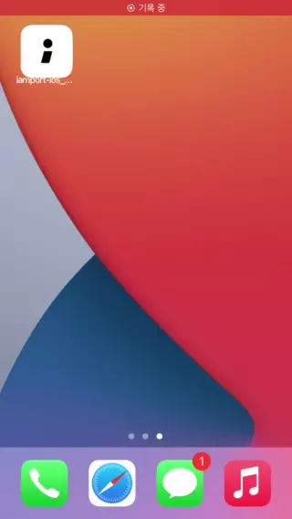
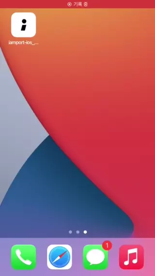
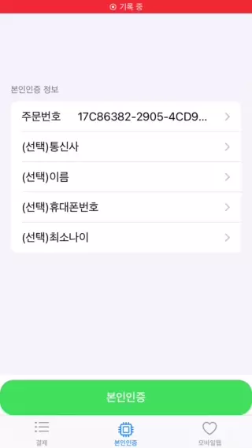

# :seedling: I'mport iOS SDK :seedling:

# iamport-ios

[](https://www.travis-ci.com/github/iamport/iamport-ios)
[](https://cocoapods.org/pods/iamport-ios)
[](https://cocoapods.org/pods/iamport-ios)
[](https://cocoapods.org/pods/iamport-ios)


## 설명

iOS 네이티브 앱에서 결제 개발을 간편하게 도와주는 아임포트 SDK 입니다.

- CHAI 간편결제는 Native 연동되어 있습니다.

- 여러 PG 들을 WebView 기반으로 결제 할 수 있습니다.

- 추후 순차적으로 타 간편결제들도 네이티브 연동 예정입니다. 

--- 

- [포트원][1]

- [포트원 블로그][2]

- [포트원 docs][3]

[1]: https://portone.io/
[2]: http://blog.portone.io/
[3]: https://portone.gitbook.io/


---

## iOS plist 설정방법

<details>
<summary>iOS 설정 펼쳐보기</summary>

# iOS 설정하기

iOS에서 아임포트 결제연동 모듈을 사용하기 위해서는 아래 3가지 항목을 설정해주셔야 합니다.

#### 1. App Scheme 등록
외부 결제 앱(예) 페이코, 신한 판 페이)에서 결제 후 돌아올 때 사용할 URL identifier를 설정해야합니다.


1. `[프로젝트 폴더]/ios/[프로젝트 이름]/Info.plist` 파일을 연 후 `URL types`속성을 추가합니다.
2. item `0`를 확장하여 `URL schemes`를 선택합니다.
3. item `0`에 App Scheme을 작성합니다.


#### 2. 외부 앱 리스트 등록
3rd party앱(예) 간편결제 앱)을 실행할 수 있도록 외부 앱 리스트를 등록해야합니다. 

1. `[프로젝트 폴더]/ios/[프로젝트 이름]/Info.plist` 파일을 오픈합니다.
2. [LSApplicationQueriesSchemes](https://developer.apple.com/library/content/documentation/General/Reference/InfoPlistKeyReference/Articles/LaunchServicesKeys.html#//apple_ref/doc/uid/TP40009250-SW14) 속성을 추가하고 아래에 외부 앱 리스트를 등록합니다.
- [예제 Info.plist 참조](./Example/iamport-ios/Info.plist)
```html
<key>LSApplicationQueriesSchemes</key>
<array>
  <string>kftc-bankpay</string> <!-- 계좌이체 -->
  <string>ispmobile</string> <!-- ISP모바일 -->
  <string>itms-apps</string> <!-- 앱스토어 -->
  <string>hdcardappcardansimclick</string> <!-- 현대카드-앱카드 -->
  <string>smhyundaiansimclick</string> <!-- 현대카드-공인인증서 -->
  <string>shinhan-sr-ansimclick</string> <!-- 신한카드-앱카드 -->
  <string>smshinhanansimclick</string> <!-- 신한카드-공인인증서 -->
  <string>kb-acp</string> <!-- 국민카드-앱카드 -->
  <string>mpocket.online.ansimclick</string> <!-- 삼성카드-앱카드 -->
  <string>ansimclickscard</string> <!-- 삼성카드-온라인결제 -->
  <string>ansimclickipcollect</string> <!-- 삼성카드-온라인결제 -->
  <string>vguardstart</string> <!-- 삼성카드-백신 -->
  <string>samsungpay</string> <!-- 삼성카드-삼성페이 -->
  <string>scardcertiapp</string> <!-- 삼성카드-공인인증서 -->
  <string>lottesmartpay</string> <!-- 롯데카드-모바일결제 -->
  <string>lotteappcard</string> <!-- 롯데카드-앱카드 -->
  <string>cloudpay</string> <!-- 하나카드-앱카드 -->
  <string>nhappcardansimclick</string> <!-- 농협카드-앱카드 -->
  <string>nonghyupcardansimclick</string> <!-- 농협카드-공인인증서 -->
  <string>citispay</string> <!-- 씨티카드-앱카드 -->
  <string>citicardappkr</string> <!-- 씨티카드-공인인증서 -->
  <string>citimobileapp</string> <!-- 씨티카드-간편결제 -->
  <string>kakaotalk</string> <!-- 카카오톡 -->
  <string>payco</string> <!-- 페이코 -->
  <string>lpayapp</string> <!-- (구)롯데 L페이 -->
  <string>hanamopmoasign</string> <!-- 하나카드 공인인증앱 -->
  <string>wooripay</string> <!-- (구) 우리페이 -->
  <string>nhallonepayansimclick</string> <!-- NH 올원페이 -->
  <string>hanawalletmembers</string> <!-- 하나카드(하나멤버스 월렛) -->
  <string>chaipayment</string> <!-- 차이 -->
  <string>kb-auth</string> <!-- 국민 -->
  <string>hyundaicardappcardid</string>  <!-- 현대카드 -->
  <string>com.wooricard.wcard</string>  <!-- 우리won페이 -->
  <string>lmslpay</string>  <!-- 롯데 L페이 -->
  <string>lguthepay-xpay</string>  <!-- 페이나우 -->
  <string>liivbank</string>  <!-- Liiv 국민 -->
  <string>supertoss</string>   <!-- 토스 -->
  <string>newsmartpib</string>   <!-- 우리WON뱅킹 -->
</array>
```


#### 3. App Transport Security 설정


1. `[프로젝트 폴더]/ios/[프로젝트 이름]/Info.plist` 파일을 오픈합니다.
2. `App Transport Security` 속성을 추가합니다.
3. 하부 속성에 `Allow Arbitrary Loads in Web Content`,`Allow Arbitrary Loads` 속성을 추가하고 각각의 값(value)을 `YES`로 변경합니다.

```html
<key>NSAppTransportSecurity</key>
<dict>
  <key>NSAllowsArbitraryLoadsInWebContent</key>
  <true/>
  <key>NSAllowsArbitraryLoads</key>
  <true/>
</dict>
```

</details>


## Example

To run the example project, clone the repo, and run `pod install` from the Example directory first.

## Requirements

## Installation

iamport-ios is available through [CocoaPods](https://cocoapods.org). To install
it, simply add the following line to your Podfile:

[[최신버전 확인]](https://github.com/iamport/iamport-ios/releases)

- cocoapods 이용시 (RxSwift 5.x 사용)
```ruby
pod 'iamport-ios', '~> 1.4.2'
```


- Swift Package Manager 이용시 (RxSwift 6.x 사용)
```ruby
iamport-ios 1.1.0 부터 지원
```

## Usage

> - UINavigationController 사용의 경우.  
  storyboard 의 root view controller 에서
  Xcode 상단 -> Editor -> Embed in -> Navigation Controller.
> - UIViewController, WKWebView 지원.

```swift
  // 결제 요청 데이터 구성 
  let payment = IamportPayment(
                pg: PG.html5_inicis.getPgSting(pgId: ""), // PG 사
                merchant_uid: "mid_123456",                   // 주문번호                
                amount: "1000").then {                        // 가격
                  $0.pay_method = "card"                      // 결제수단
                  $0.name = "샘플 머천트에서 주문~"                // 주문명
                  $0.buyer_name = "독고독"                     
                  $0.app_scheme = "iamport"                   // 결제 후 앱으로 복귀 위한 app scheme
              }

  // I'mport SDK 에 결제 요청
  // case1 : UINavigationController 사용
  Iamport.shared.payment(navController: navigationController, // 네비게이션 컨트롤러
                         userCode: userCode, // 머천트 유저 식별 코드
                         payment: payment) // 결제 요청 데이터
                         { [weak self] iamportResponse in
                            // 결제 종료 콜백
                         }

  // case2 : UIViewController 사용
  Iamport.shared.payment(viewController: viewController, /* 이하동일.. */)

  // case3 : WebView 를 바로 넘겨 결제를 원하면, 아래 [Optional 구현사항 WebView Mode 와 MobileWeb Mode] 참조하세요.
  
  Iamport.shared.close() // sdk 종료 원할시 호출
```


```swift
  // AppDelegate.swift 설정
  func application(_ app: UIApplication, open url: URL, options: [UIApplication.OpenURLOptionsKey : Any] = [:]) -> Bool {
      Iamport.shared.receivedURL(url)
      return true
  }
```


---

### Optional 구현사항 WebView Mode 와 MobileWeb Mode
<details>
<summary>펼쳐보기</summary>

> 본 sdk 에서는 기본적으로 결제연동의 편의를 제공하고자  
Iamport.payment 를 통해 결제 요청시 새로운 UIViewController 가 열리고,   
내부적으로 WebView 를 생성하여 전달해주신 parameters 를 통해 결제창을 열고 있습니다.

그러나 요청에 따라 개발의 자유도를 드리기 위해 WebView Mode, MobileWeb Mode 두가지가 추가되었습니다. ( <= 1.0.0-dev08 )

### 1. WebView Mode

설명 : 결제페이지를 직접 생성하시고 iamport-sdk 에 WKWebView 를 넘겨 결제를 진행합니다.  
ex) 직접 결제페이지를 꾸미기 원하는 분.

- 반영방법 : 기존 위의 [Usage] 사항 과 같이 iamport-sdk 세팅을 합니다.  
Iamport.shared.paymentWebView 호출 파라미터 중 webview 에 WKWebView 를 넣어주시면 됩니다.
그 외는 기존의 동작과 같습니다.
> [PaymentWebViewModeView.swift 참조](./Example/iamport-ios/View/PaymentWebViewModeView.swift)
> 
```swift
Iamport.shared.paymentWebView(webViewMode: wkWebView, /*이하 동일*/)
```    


### 2. MobileWeb Mode
- 설명 : 아임포트를 사용하는 Mobile 웹페이지가 load 된 webview 를 넘겨 결제 진행을 서포트 합니다.    
ex) 이미 웹사이트에서 아임포트 js sdk 를 이용하고 있고, 본인 서비스를 app 으로만 감싸서 출시 하고자 하시는 분.

- 반영방법 Step1 : ios 앱에서 기존 위의 [Usage] 사항 과 같이 iamport-sdk 세팅을 합니다.  
추가로 Iamport.shared.pluginMobileWebSupporter(webview) 를 호출하여 파라미터로 webview 를 전달합니다.  
실제 결제 진행은 고객님의 웹사이트 내에서 진행됩니다.  
> [mobileweb.html 참조](./Example/iamport-ios/mobileweb.html) (예시이며 실제로는 고객님의 Front-End 가 됩니다.)  
> [PaymentMobileWebMode.swift 참조](./Example/iamport-ios/View/PaymentMobileWebMode.swift)

```swift
Iamport.shared.pluginMobileWebSupporter(mobileWebMode: wkWebView)
```

- 반영방법 Step2 : 기존 js sdk 를 사용하는 웹 프론트엔드(html) 의  
`IMP.request_pay`, `IMP.certification` 를 호출하는 곳 위에서, 아래의 코드를 추가합니다.  


- 전달하는 데이터 형식
```javascript
// 1. `IMP.request_pay`를 통한 결제의 경우
const params = {
    userCode: userCode, // 가맹점 식별코드
    payment: payment,   // 결제 데이터
};

// 2. `IMP.certification`를 통한 본인인증의 경우
const params = {
    userCode: userCode,           // 가맹점 식별코드
    certification: certification, // 본인인증 데이터
};

```  

- 예시코드
```javascript
// 예시
// start of 추가되는 부분
const isIOS = (/iphone|ipad|ipod/i.test(navigator.userAgent.toLowerCase()));
if(isIOS) {
    try {
        const params = {
          userCode : userCode,                                   // 가맹점 식별코드
          iamportRequest : data,                                 // 결제 데이터
        };
      window.webkit.messageHandlers.iamportmobilewebmode.postMessage(params)
    } catch (error) {
      console.error(error);
    }
}
// End of 추가되는 부분

// 기존의 js IMP.request_pay
IMP.request_pay(data, ... // 생략
```

  

- Custom WKWebViewDelegate 의 사용

```swift

/**
 webview url 을 통해 처리하는 로직이 있을 경우에 
 [IamportWKWebViewDelegate] 상속하여 사용 하시거나,
 [Iamport.shared.updateWebViewUrl] 의 subscribe 을 통해 변경되는 url 을 체크 가능합니다.
 */
// CASE1 : IamportWKWebViewDelegate 상속
class MyWKWebViewDelegate: IamportWKWebViewDelegate {
    override func webView(_ webView: WKWebView, decidePolicyFor navigationAction: WKNavigationAction, decisionHandler: @escaping (WKNavigationActionPolicy) -> Void) {
        if let url = navigationAction.request.url {
            // TODO : write your logic
            print("MyWKNavigationDelegate received url : \(url)")
        }

        super.webView(webView, decidePolicyFor: navigationAction, decisionHandler: decisionHandler)
    }
}

let webViewDelegate = MyWKWebViewDelegate()

class MyView: UIViewController {
    override func viewDidAppear(_ animated: Bool) {
        ..
        // IamportWKWebViewDelegate 사용
        wkWebView.navigationDelegate = webViewDelegate as WKNavigationDelegate
        
//       CASE2 : [Iamport.shared.updateWebViewUrl] 사용
        Iamport.shared.updateWebViewUrl.subscribe { [weak self] url in
            print("updateWebViewUrl received url : \(url.element)")
        }.disposed(by: disposeBag)
    }
}

```


</details>

---

### Optional 구현사항 SwiftUI 에서의 사용
<details>
<summary>펼쳐보기</summary>

> SwiftUI 를 사용하시는 분들은 위의 WebViewMode 를 사용하시거나,   
아래 코드를 참조하시어 UIViewContorller 를 구성해 사용하시기 바랍니다.  

> 또한 Example app 에 반영되어 있으니 참고하시기 바랍니다.   
> [PaymentView.swift 참조](./Example/iamport-ios/View/PaymentView.swift)

```swift
struct IamportPaymentView: UIViewControllerRepresentable {

  func makeUIViewController(context: Context) -> UIViewController {
    let view = IamportPaymentViewController()
    return view
  }

  func updateUIViewController(_ uiViewController: UIViewControllerType, context: Context) {}
}

class IamportPaymentViewController: UIViewController {

  // 아임포트 SDK 결제 요청 
  func requestIamportPayment() {
    let userCode = "iamport" // iamport 에서 부여받은 가맹점 식별코드
    let payment = createPaymentData()
    
    Iamport.shared.payment(viewController: self,
            userCode: userCode, payment: payment) { [weak self] response in
      print("결과 : \(response)")
    }
  }

  // 아임포트 결제 데이터 생성
  func createPaymentData() -> IamportPayment {
    return IamportPayment(
            pg: PG.html5_inicis.makePgRawName(pgId: ""),
            merchant_uid: "swiftui_ios_\(Int(Date().timeIntervalSince1970))",
            amount: "1000").then {
      $0.pay_method = "card"
      $0.name = "SwiftUI 에서 주문입니다"
      $0.buyer_name = "SwiftUI"
      $0.app_scheme = "iamporttest" // 결제 후 돌아올 앱스킴
    }
  }
}
```


</details>

---

### Optional 구현사항 SceneDelegate 에서의 사용 (target iOS13)
<details>
<summary>펼쳐보기</summary>

> iOS 13 부터는 기존의 AppDelegate 으로 부터 UILifecycle 관리가 분리되면서    
> SceneDelegate 가 추가되었습니다.   
> AppDelegate 사용 코드 대신 아래 코드를 참조해서 반영하시기 바랍니다.  
> [SceneDelegate.swift 참조](./Example/iamport-ios/SceneDelegate.swift)

```swift
class SceneDelegate: UIResponder, UIWindowSceneDelegate {
    ..
  func scene(_ scene: UIScene, openURLContexts URLContexts: Set<UIOpenURLContext>) {
    if let url = URLContexts.first?.url {
      Iamport.shared.receivedURL(url)
    }
  }  
}
```


</details>

---

## 💡 샘플앱

- SwiftUI 로 작성(Target iOS 13)  

<p float="left">



</p>

[앱 소스 확인 경로](./Example/iamport-ios)

실행방법 

1. git clone 
2. Xcode project open
3. connect iPhone via USB Cable(or use Simulator, Simulator 사용시 결제 확인은 불가능 합니다.)
4. build [Example app](./Example)
  
- [UIKit 예제는 링크를 참조하세요](./Example/iamport-ios/View/ViewController.swift)


## Support

PortOne 기술지원, support@portone.io

## License

iamport-ios is available under the MIT license. See the LICENSE file for more info.
